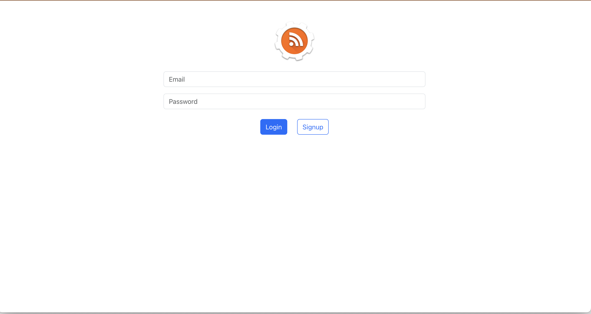
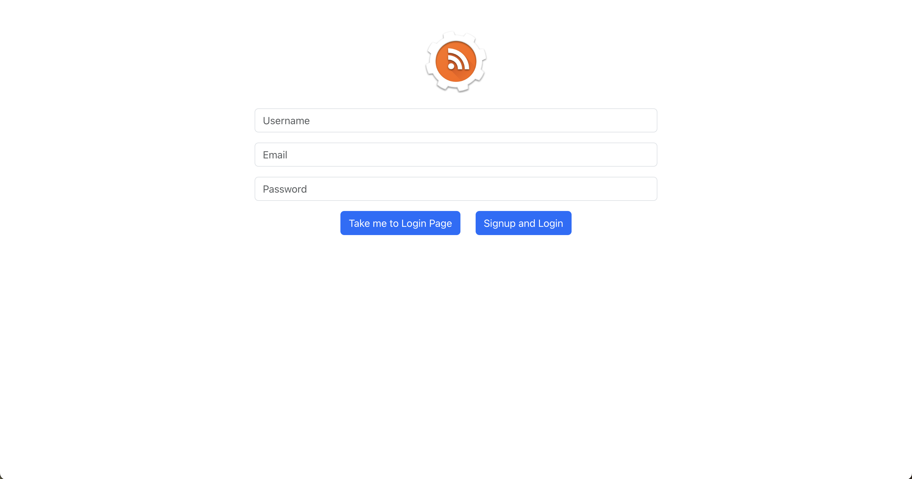
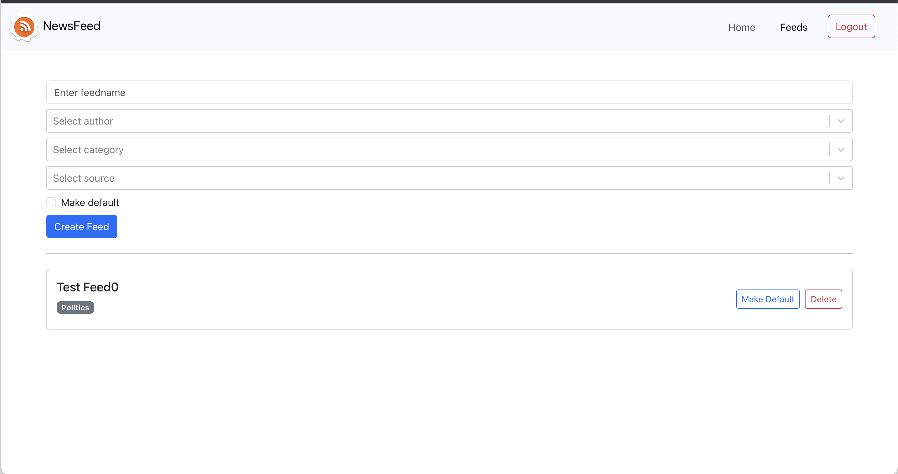
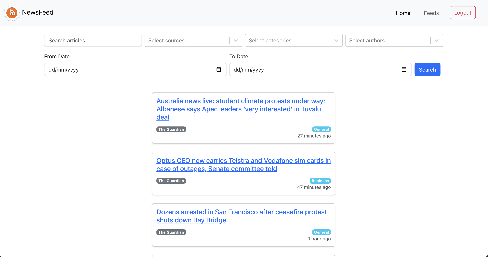

# news-aggregator-frontend
- Make a new file called .env that is copied from .env.example
- Update the value of `REACT_APP_API_BASE_URL` to be the server base url (For this case set it to `http://localhost:8000`)
- Run the following command to run the instance
    > `docker-compose up`

Your application should now be accessible at http://localhost:3000

# Screenshots

